# Blog Page

This is a web page used for making blog posts. Users can sign in, create blog posts, and post comments to blog posts.

## Essential Code

**Root Route GET Request**
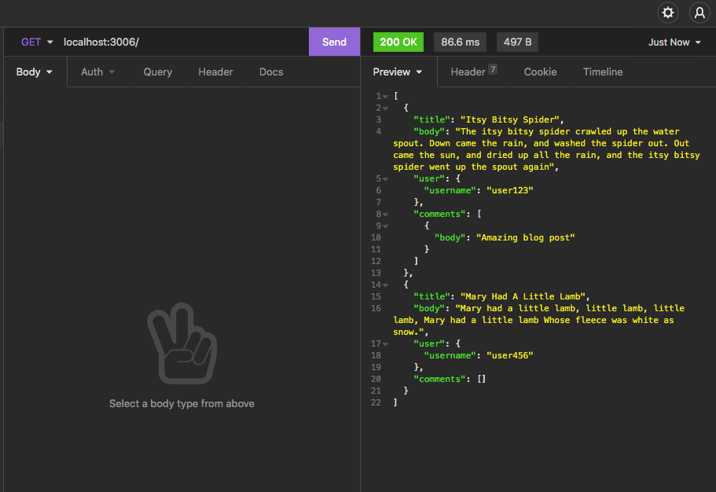  
  
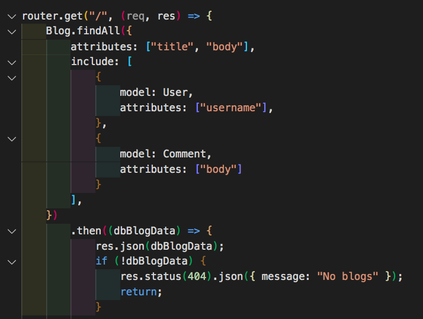
  
**Login POST Request**  
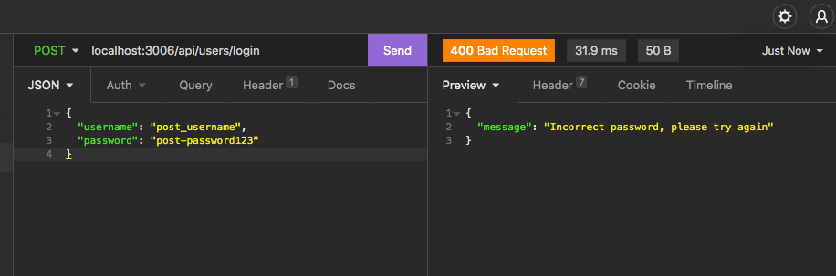  
  
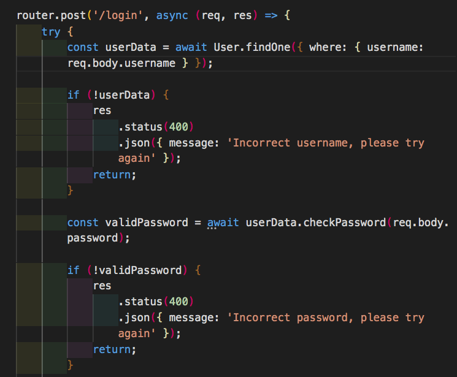
  
**Create User POST Request**  
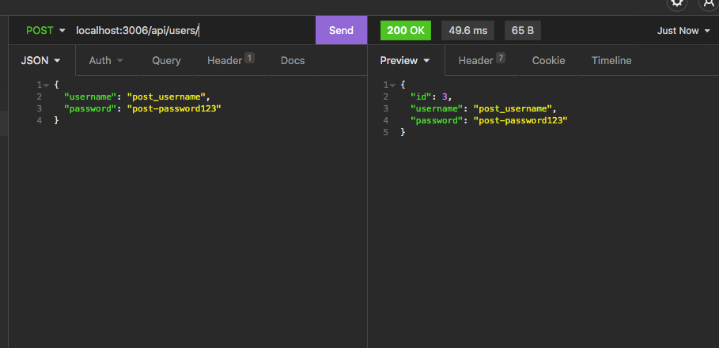  
  
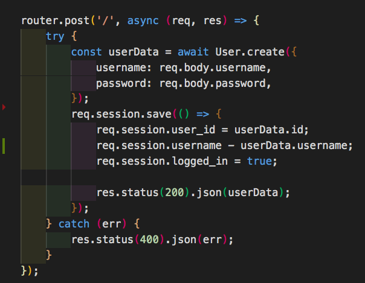
  
**Create New Blog POST Request**  
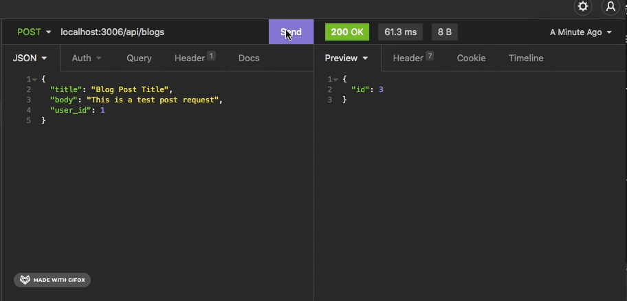  
  
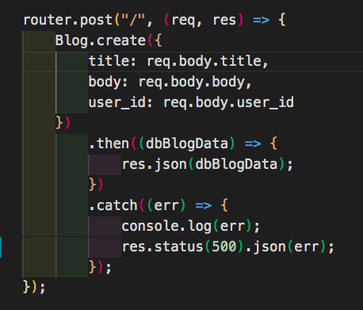  

**JSON Data of Blog Post Titles, Bodies, Usernames, and Comments**  
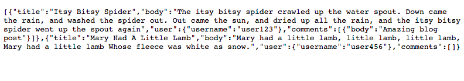  
  

  
**Individual Blog Post GET Request**  
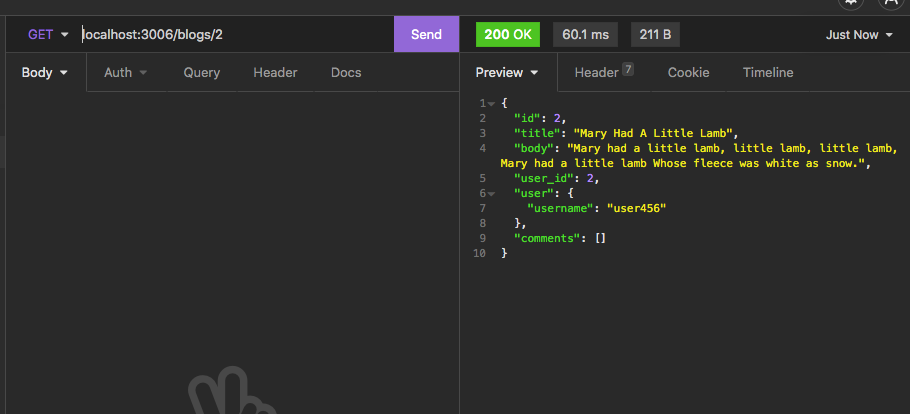  
  
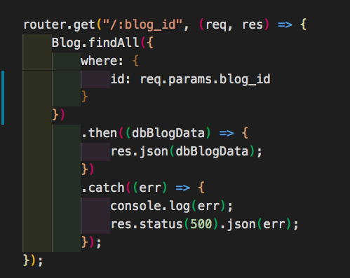

**Sample SQL Database Table**  
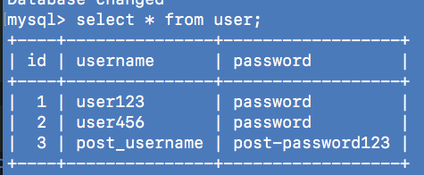  
  

## Built With

* [HTML](https://developer.mozilla.org/en-US/docs/Web/HTML)
* [CSS](https://developer.mozilla.org/en-US/docs/Web/CSS)
* [Javascript](https://developer.mozilla.org/en-US/docs/Web/JavaScript)
* [JQuery](https://developer.mozilla.org/en-US/docs/Glossary/jQuery)
* [Handlebars](https://handlebarsjs.com/)
* [MySql2](https://www.npmjs.com/package/mysql2)
* [Sequelize](https://sequelize.org/)
* [DotEnv](https://www.npmjs.com/package/dotenv)
* [Express](https://expressjs.com/en/guide/routing.html)
* [Bcrypt](https://www.npmjs.com/package/bcrypt)

## Deployed Link

* [See Live Site](#)

## Author

**Courtney Foster** 

- [Link to Portfolio Site](https://cfoster121.github.io/portfolio/)
- [Link to Github](https://github.com/cfoster121)
- [Link to LinkedIn](https://www.linkedin.com/in/courtney-foster-0b364575/)

## License

This project is licensed under the MIT License 

## Acknowledgments

* [W3 Schools](https://www.w3schools.com/)
* [MDN Web Docs](https://developer.mozilla.org/en-US/)
* [Gif Application](https://gifox.io/)
* [Markdown Preview](https://dillinger.io/)
* TA sessions
